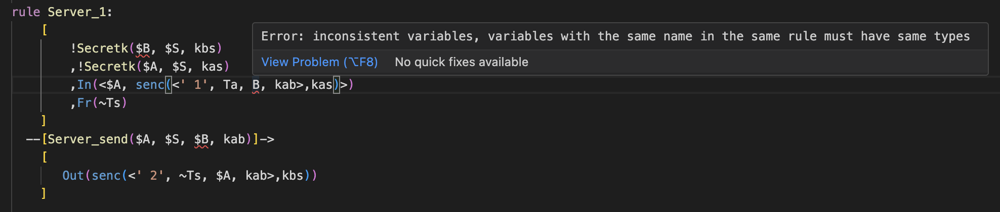

# Tamarin Visual Studio Code extension

The official Visual Studio Code extension for Tamarin files (.spthy) supported by the Tamarin team. Based on [giclu-3's extension](https://github.com/gilcu3/vscode-tamarin) and using [Tamarin's tree-sitter grammar](https://github.com/tamarin-prover/tamarin-prover/pull/648).



Features:

- Enhances giclu-3's syntax highlighting.
- Adds comprehensive syntax error detection based on the grammar with ```MISSING``` or ```ERROR``` messages.
- Provides various wellformedness checks:
    - Checks position and usage of reserved facts (```Fr```, ```Out```, ```In```, ```K```, ```KD```, ```KU```).
    - Checks whether variable are used consistly inside a rule, i.e., using the same capitalization and sort.
    - Spellcheck on facts (must start with an uppercase letter).
    - Checks whether all variables in the conclusion of a rule appear in the premises (except public variables).
    - Checks the arity of facts and functions.
    - Checks whether a lemma uses free terms.
    - Checks whether all facts in the premises of the rules appear in the conclusion of some (other) rule (provides a quick fix by using the closest exisiting fact, based on editing distance).
    - Checks wether all variables in the right hand side of a macro are in the left hand side or public.
    - Checks wether all variable in the right hand side of an equation are in the left hand side.
    - Provides a quick fix for function names (suggestions based on editing distance).
    - Checks wether built-ins are imported when encountering corresponding functions or symbols (provides a quick fix to import the right built-in).
    This is a subset of the checks performed by Tamarin. For more details on Tamarin's wellformedness checks, see the corresponding [Tamarin Prover manual section](https://tamarin-prover.com/manual/master/book/010_modeling-issues.html).
- Supports two file types:
    - spthy is the default format for Tamarin files.
    - splib files are library files that do not contain the theory name, "begin" and "end". They can be imported using ``` include "file.splib"```.
- Supports recursive analysis, ie, included files are taken into account for wellformedness checks .

- Use right click and ```Rename``` on an indentifier to rename all occurences of it inside a rule or a lemma.
- Use right click and ```Search Definition``` on facts or function names and press ```CTRL```+```ALT```+```n``` to navigate through all occurences.

